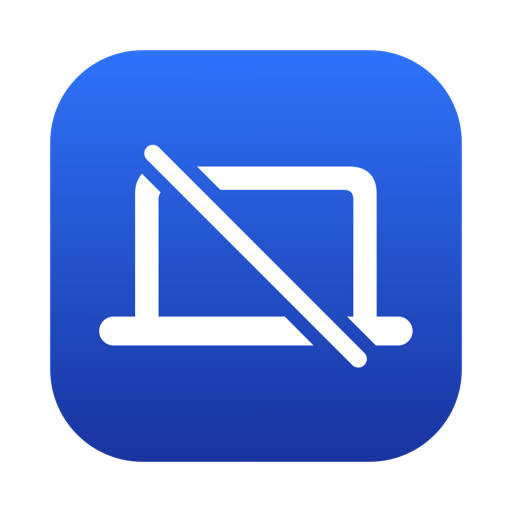

  

<h1 align="center">QDisplay</h1>

  Tắt màn hình MacBook khi dùng màn hình ngoài — <b>không cần gập nắp</b>. 
  Ứng dụng menu bar native cho macOS, bật/tắt từng màn hình chỉ bằng một công tắc.

  

---

## 📥 Tải về

| Hệ điều hành | Dòng máy | Định dạng | Link tải trực tiếp |
| :--- | :--- | :---: | :--- |
|  **macOS 13 trở lên** | **Mac Apple Silicon** (M1, M2, M4…) | `.dmg` | [Tải về QDisplay-0.1.0-AppleSilicon.dmg](https://github.com/beolamtat/qdisplay/releases/download/v0.1.0/QDisplay-0.1.0-AppleSilicon.dmg) |

**Phiên bản đầu tiên v0.1.0**

---

## ✨ Tính năng

- **Bật/tắt từng màn hình**: Mỗi màn hình (MacBook và màn ngoài) có một công tắc riêng, hiển thị tên, độ phân giải, tần số quét và màn hình chính.
- **Mở nắp vẫn dùng được bàn phím, trackpad, Touch ID, loa, camera** — chỉ màn hình MacBook tắt hẳn (cả đèn nền), màn ngoài thành màn chính.
- **Tắt đèn bàn phím theo màn hình**: Tiện khi dùng bàn phím và chuột rời; bật lại màn hình là đèn bàn phím về đúng độ sáng cũ.
- **Không bao giờ để bạn mất màn hình**:
  - Rút màn hình ngoài khi màn MacBook đang tắt → màn MacBook tự sáng lại ngay.
  - Không thể tắt màn hình cuối cùng đang bật.
  - Thoát ứng dụng, ứng dụng bị lỗi hoặc bị Force Quit → màn hình MacBook và đèn bàn phím được bật lại tự động.
  - Khởi động lại máy → mọi thứ trở về bình thường.
- **Giữ lựa chọn của bạn** khi máy ngủ / thức, khoá / mở khoá màn hình, gập / mở nắp.
- **Nhẹ & riêng tư**: ~0,7 MB, không cần quyền Accessibility, không cần quyền quản trị, không kết nối mạng.
- **Khởi động cùng máy** (tuỳ chọn).

---

## 🚀 Hướng dẫn cài đặt

1. [Tải QDisplay-0.1.0-AppleSilicon.dmg](https://github.com/beolamtat/qdisplay/releases/download/v0.1.0/QDisplay-0.1.0-AppleSilicon.dmg).
2. Mở file `.dmg`, kéo **QDisplay** vào thư mục **Applications**.
3. Mở **QDisplay** từ thư mục Applications. Biểu tượng 💻 xuất hiện trên thanh menu.

> [!IMPORTANT]
> QDisplay chưa được Apple notarize nên lần mở đầu tiên macOS sẽ chặn. Cách mở:
> - Vào **System Settings → Privacy & Security**, kéo xuống và bấm **Open Anyway** cho QDisplay, **hoặc**
> - Chạy lệnh trong Terminal: `xattr -dr com.apple.quarantine /Applications/QDisplay.app`

---

## 🖥️ Cách dùng

1. Cắm màn hình ngoài.
2. Bấm biểu tượng 💻 trên thanh menu.
3. Gạt tắt **Màn hình MacBook** — màn MacBook tối hẳn, màn ngoài thành màn chính.
4. Muốn bật lại: gạt bật công tắc, hoặc chỉ cần rút màn hình ngoài.

